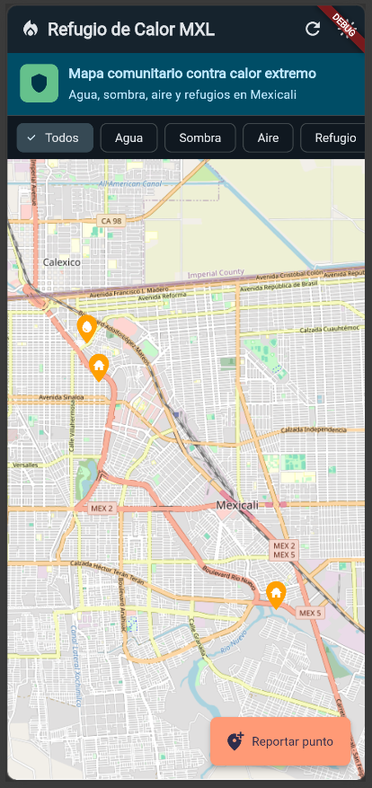
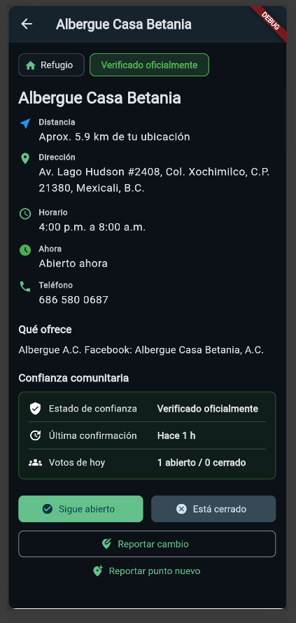
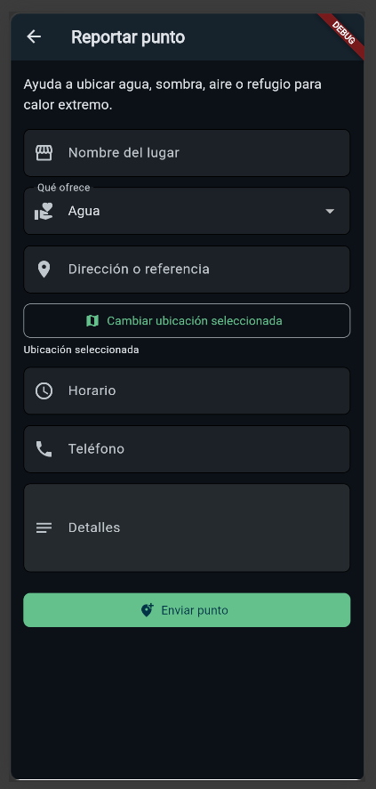

# Refugio de Calor MXL

**Refugio de Calor MXL** es una app comunitaria para Mexicali, Baja California, creada para ubicar y reportar puntos seguros durante temporadas de calor extremo.

La app permite encontrar lugares con **agua, sombra, aire acondicionado o refugio**, además de enviar nuevos puntos para que puedan ser revisados antes de aparecer públicamente.

## ¿Por qué existe?

En Mexicali, el calor extremo representa un riesgo real para muchas personas, especialmente quienes pasan tiempo en la calle o tienen menos acceso a espacios seguros.

Personas caminando bajo el sol, adultos mayores, migrantes, trabajadores, estudiantes y personas en situación vulnerable pueden necesitar un punto cercano donde hidratarse, descansar o resguardarse.

El problema es que no siempre existe una lista clara, pública y actualizada de todos los puntos de hidratación o refugio disponibles.

## ¿Qué propone?

Refugio de Calor MXL propone un mapa comunitario donde las personas puedan encontrar, confirmar y reportar puntos seguros.

La idea no es depender solamente de una lista oficial, sino permitir que la comunidad ayude a mantener la información viva y actualizada.

## Funciones principales

* Mapa interactivo con puntos seguros.
* Filtros por tipo de ayuda: agua, sombra, aire acondicionado y refugio.
* Ficha detallada de cada punto.
* Botones para confirmar si un punto sigue abierto o está cerrado.
* Reporte de nuevos puntos por parte de la comunidad.
* Selector de ubicación en mapa.
* Panel admin para revisar, aprobar, rechazar u ocultar reportes.
* Estado automático según horario.
* Límite de reportes para evitar spam.

## Enfoque comunitario

Los puntos reportados por usuarios no aparecen automáticamente como confiables. Primero pasan por revisión para evitar información falsa, duplicada o peligrosa.

Cada punto puede tener información como:

* Dirección o referencia.
* Horario.
* Qué ofrece.
* Teléfono.
* Estado actual.
* Última confirmación.
* Nivel de confianza.

## Arquitectura pensada para bajo costo

El proyecto separa los datos base de los datos dinámicos.

Los puntos principales se cargan desde un archivo JSON local, mientras que Firebase se usa solo para información que cambia, como reportes, votos, estados comunitarios y moderación.

Esto evita que cada usuario tenga que leer cientos de documentos desde Firestore cada vez que abre el mapa.

## Tecnologías usadas

* Flutter
* Firebase Authentication
* Cloud Firestore
* OpenStreetMap / Flutter Map
* JSON local

## Estado actual

El proyecto se encuentra en fase de prototipo funcional.

Actualmente cuenta con mapa, filtros, fichas de puntos, reportes comunitarios, panel admin, selector de ubicación, horarios automáticos y una estructura optimizada para reducir lecturas en Firebase.

## Capturas

| Mapa principal                          | Detalle de punto                             | Reportar punto                              |
| --------------------------------------- | -------------------------------------------- | ------------------------------------------- |
|  |  |  |

## Presentación

Este repositorio incluye un pitch deck corto del proyecto:

* `docs/Refugio_de_Calor_MXL_Pitch.pptx`

## Próximos pasos

* Probar la app con usuarios reales.
* Validar puntos reales en campo.
* Añadir más puntos verificados.
* Mejorar la calidad de los datos.
* Difundir el proyecto en la comunidad.
* Buscar colaboración con medios, instituciones o grupos locales.

## Autor

Desarrollado por **Jorge Lachica**.

Mexicali, Baja California.
